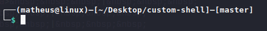
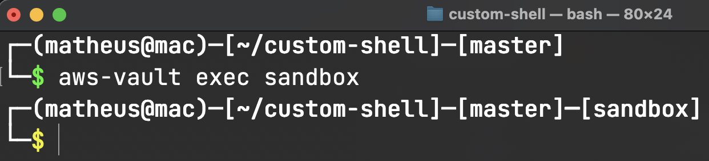

<h1 align="center">CUSTOM SHELL</h1>

<p align="center">
    <a href="#about">About</a>&nbsp;&nbsp;&nbsp;|&nbsp;&nbsp;&nbsp;
    <a href="#installation">Installation</a>&nbsp;&nbsp;&nbsp;|&nbsp;&nbsp;&nbsp;
    <a href="#contributing">Contributing</a>&nbsp;&nbsp;&nbsp;|&nbsp;&nbsp;&nbsp;
    <a href="#license">License</a>
</p>

<br>

## About
Customize your shell `BASH` in your unix environment


</br>


## Installation

#### 1. Direct installation
```
curl -s https://raw.githubusercontent.com/almeida-matheus/custom-shell/master/custom-bash.sh | bash
```

or
#### 1. Clone git repository
```
git clone "https://github.com/almeida-matheus/custom-shell"
```

#### 2. Add permission to execute
```
cd custom-shell/
chmod +x custom-bash.sh
```
#### 3. Execute the script
```
./custom-bash.sh
```

## Contributing
1. Fork the Project
2. Create your Feature Branch (`git checkout -b branch-name`)
3. Add your Changes (`git add .`)
4. Commit your Changes (`git commit -m 'add some feature'`)
5. Push to the Branch (`git push origin branch-name`)
6. Open a Pull Request

## License
Distributed under the MIT License. See [LICENSE](LICENSE) for more information.
